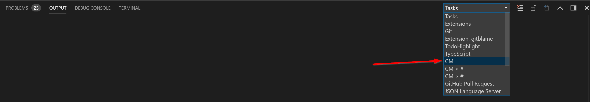

# Settuping up CM in VSCode

## Recommended Settings

These are the settings we recomment you put in your user settings for VSCode (`Ctrl+,`):

```json
{
    "cm.clearOutputBuild": true,
    "cm.autoComplete80Enabled": true,
    "cm.root": "auto",
    "[cm]": {
        "editor.suggestOnTriggerCharacters": false,
        "editor.quickSuggestions": {
            "other": false,
            "comments": false,
            "strings": false
        }
    }
}
```

| Setting | Description 
| --- | ---
| clearOutputBuild | This just clears the output pane each time you do a compile operation. You can set this to `false` if you'd like
| autoComplete80Enabled | This tells VSCode to use the CM compilers native autocomplete/intellisense. Setting this to false will yeild no autocomplete results.
| root | Really this should always be `auto`. Otherwise it can be the absolute path to your `CetDev\workspace` folder.
| [cm] | This section tweaks a few ways that VSCode works when in CM files. This basically tells VSCode to not invoke intellisense unless you specifically hit `CTRL+Space` (Or whatever your keybind might be for this). The CM Compiler doesn't do well with how ofter VSCode normally invokes intellisense, so this makes it so you can do it on demand only.

## Opening your extension Folder

Woring in VSCode is a little different then EMACS for CM development. It's been built to work a little more in a project focused pattern. By this we mean we recommend you open the folder you extension is in, and not the root CM folder in VSCode.

So if your extension is in `/CetDev/version9.5/custom/mySweetExtension` you should open this folder in VSCode. This will make it easier when using some of the commands we have build such as Compiling your Workspace.

## Starting CM

Once you have your extension folder open in VSCode, you should be able to invoke the command `CM: Start CM` (By default `F1` and begin to type `start cm` and then you can pick it from the list). You *should* see some output in the `OUTPUT` pane, but if you don't verify you are on the `CM` output channel:



This output channel will show the same things the CM buffer in EMACs would show.

## Managing CM Commands

We have a few commands avialble to manage the CM Process: (Again accessed via `F1` or `CTRL+SHIFT+P` by default):

| command | description
| --- | ---
| CM: Stops CM | This will stop the compiler process
| CM: Clean CM | This will clean the compiler process (basically next time you start is a clean start)
| CM: Quit Debug | When in debug mode, this will exit the compiler debug (`CM d>` in the output pane)
| CM: Compile File | Saves the current file and tells the compile to compile just this file (File that has focus)
| CM: Compile VSCode Workspace | Will compile all *VSCODE* workspaces (aka each top level folder you have open, so if you have `extension1` and `extension2` open, it will compile them and everything below them)
| CM: Compile Specific Workspace | This will give you a list of all your *VSCODE* workspaces so you can pick which to compile
| CM: Run Current File | Saves the current file and tells the compiler to run this file
| CM: Start CET Designer | Issues command to start the CET Designer process (if you don't already have this in your boot.cm)