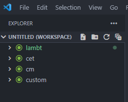
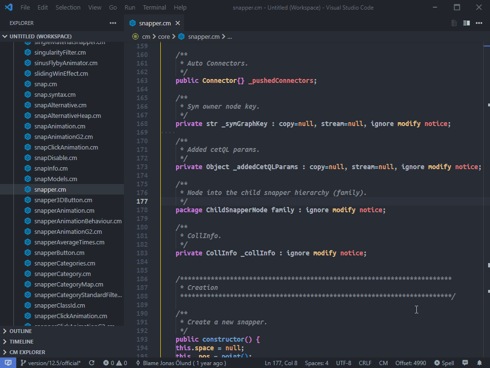

# Usage Tips for the VSCode Extension

## Opening Multiple Folders inside a single VSCode

Working with CM in VSCode is a lot more fluid / helpful when you give it more folders to search against. Personally I add the following folders to my VSCode workspace so I can search core code easier (path before CM Workspace may vary):

- base\cm
- base\custom
- base\cet

To add folders to your current VSCode worksapce:

`File > Add Folder to Workspace`

After setting up your workspace you can save the workspace (`File > Save Workspace as`) to reuse later to open up all the folders as you had them. Note this has nothing to do with a CM Workspace. Below is a sample workspace if I was working on the `lambt` extension:

Having more folders in your workspace gives you a few benefits:

1. Global Search
    - Using `CTRL+SHIFT+F` will let you search not only your code base, but Core code as well. Want to find everywhere they use a method? You can search it this way.
2. Can quickly jump to core files via (`CTRL+P`).  Want to check something in core's `snapper.cm` or `CorePropObj.cm`? Just hit `CTRL+P` and type the file name to filter and quickly jump there.

## Jump Forward / Backwards

As you move around your code base, you can utilize the `Go Forward/Go Backward` feature of VSCode. If you change files and want to quickly jump back to where you were (Shortcut keys are `ALT+Left Arrow` for back, and `ALT+Right Arrow` for forward.)

